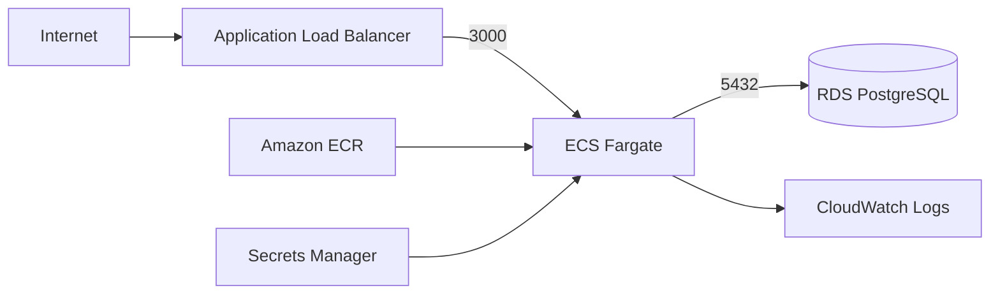
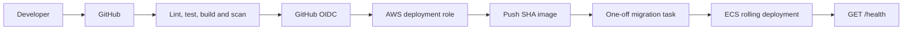

# NestForge AWS Platform

NestForge is a NestJS task-management API deployed to AWS ECS Fargate with Terraform and GitHub Actions. This repository keeps application delivery and infrastructure ownership separate while showing the complete path from a pull request to a healthy container behind an Application Load Balancer.

## Repositories

- [`nestforge-api`](nestforge-api/) contains the NestJS API, tests, TypeORM migrations, and Docker image.
- [`api-infra-terraform`](api-infra-terraform/) contains the AWS networking, ECS, RDS, ECR, IAM, monitoring, and state configuration.
- [`.github/workflows`](.github/workflows/) contains pull-request CI and the dev deployment workflow.

## Runtime architecture

The ALB is public. ECS tasks and RDS run in separate private subnet tiers, and security groups allow only ALB-to-ECS and ECS-to-RDS application traffic.

## Delivery flow

Pull requests run validation without AWS credentials. A merge to `main` uses a short-lived OIDC session to push an immutable commit-SHA image, run migrations once, deploy the ECS service, and verify `/health`. Terraform is validated in CI but is never applied by the application deployment workflow.

See the component READMEs for local development, infrastructure setup, and the one-time GitHub repository configuration.
