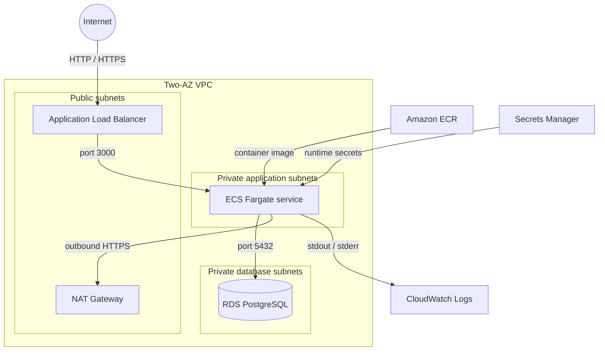

# NestForge AWS Infrastructure

Terraform for running the NestForge NestJS API on AWS ECS Fargate. The stack keeps application and database workloads private, exposes the API through an Application Load Balancer, and uses separate state and settings for development and production.

## Architecture



The ALB is the only public application entry point. ECS tasks have no public IPs, and RDS has no internet route. Security-group references restrict traffic to ALB → ECS on port 3000 and ECS → RDS on port 5432.

## Repository layout

```text
bootstrap/             S3 backend bucket created from local state
environments/dev/      Development root module and state boundary
environments/prod/     Production root module and state boundary
modules/               Reusable AWS resource modules
```

The `platform` module wires together networking, security, ECR, IAM, Secrets Manager, RDS, ALB, ECS, and monitoring. Environment roots contain values and backend configuration rather than duplicated resources.

## Design decisions

- The VPC spans two Availability Zones with public, private application, and private database subnets.
- One NAT Gateway controls cost. A higher-availability production design can use one NAT Gateway per AZ.
- ECR tags are immutable and scanned on push. Releases should use Git commit SHA tags instead of `latest`.
- RDS uses encrypted gp3 storage, automated backups, and private connectivity.
- Database credentials and the JWT signing secret are generated and stored in Secrets Manager. They also exist in Terraform state, so access to the state bucket is sensitive.
- The ECS execution role can pull the image, read the application secret, and publish logs. The application task role starts with no AWS permissions.
- CPU target tracking provides the initial ECS scaling policy.
- TypeORM migrations run as a one-off ECS task before an application rollout, avoiding races between service tasks.

## Environment defaults

| Setting | Development | Production |
|---|---:|---:|
| VPC CIDR | `10.0.0.0/16` | `10.1.0.0/16` |
| ECS tasks | 1 | 2 |
| ECS scaling range | 1–3 | 2–6 |
| RDS class | `db.t4g.micro` | `db.t4g.small` |
| RDS Multi-AZ | No | Yes |
| Backup retention | 7 days | 30 days |
| Deletion protection | No | Yes |
| Log retention | 14 days | 30 days |

Development and production use separate S3 state keys. They can share an AWS account, although separate AWS accounts provide stronger production isolation.

## Prerequisites

- Terraform `>= 1.10, < 2.0`
- AWS CLI v2 with an authenticated profile or role
- Docker Desktop for building the API image
- Permission to provision the resources in this stack
- The sibling `../nestforge-api` application repository

Verify the active identity before every plan or apply:

```powershell
aws sts get-caller-identity
aws configure get region
```

## Bootstrap Terraform state

The backend bucket is a separate root because Terraform cannot store state in a bucket that does not exist yet. Its local `terraform.tfstate` must be retained and backed up securely.

```powershell
Copy-Item bootstrap/terraform.tfvars.example bootstrap/terraform.tfvars
terraform -chdir=bootstrap init
terraform -chdir=bootstrap fmt -check
terraform -chdir=bootstrap validate
terraform -chdir=bootstrap plan -out=bootstrap.tfplan
terraform -chdir=bootstrap apply bootstrap.tfplan
```

The bucket has versioning, server-side encryption, public-access blocking, TLS enforcement, native S3 lockfile support, and a Terraform `prevent_destroy` guard.

## Initialize an environment

Development example:

```powershell
Copy-Item environments/dev/terraform.tfvars.example environments/dev/terraform.tfvars

$stateBucket = terraform -chdir=bootstrap output -raw terraform_state_bucket_name
terraform -chdir=environments/dev init -reconfigure `
  -backend-config="bucket=$stateBucket" `
  -backend-config="key=nestforge/dev/terraform.tfstate" `
  -backend-config="region=us-east-1"

terraform -chdir=environments/dev fmt -check
terraform -chdir=environments/dev validate
terraform -chdir=environments/dev plan
```

For production, use `environments/prod` and the state key `nestforge/prod/terraform.tfstate`. Review the production tfvars and AWS identity independently; do not copy development settings blindly.

## First image deployment

ECS needs an existing image before its first task can start. Create ECR once, push the initial image, and then apply the full stack:

```powershell
terraform -chdir=environments/dev plan `
  -target=module.platform.module.ecr `
  -out=ecr.tfplan
terraform -chdir=environments/dev apply ecr.tfplan

$awsRegion = "us-east-1"
$imageTag = "manual-bootstrap"
$accountId = aws sts get-caller-identity --query Account --output text
$repositoryUrl = terraform -chdir=environments/dev output -raw ecr_repository_url
$registry = "$accountId.dkr.ecr.$awsRegion.amazonaws.com"

cmd.exe /d /c "aws ecr get-login-password --region $awsRegion | docker login --username AWS --password-stdin $registry"
docker build --tag "${repositoryUrl}:${imageTag}" ../nestforge-api
docker push "${repositoryUrl}:${imageTag}"

terraform -chdir=environments/dev plan -out=dev.tfplan
terraform -chdir=environments/dev apply dev.tfplan
```

`-target` is only used to break the first-image dependency. Normal releases build and push a new immutable tag, update `image_tag`, and use a full Terraform plan. Terraform then creates a new task-definition revision and ECS performs a rolling deployment.

## Database migrations

The application image contains the compiled TypeORM migrations. A one-off Fargate task uses the normal task definition, private application subnets, ECS security group, RDS endpoint, and injected secrets, but overrides the container command with:

```text
node ./node_modules/typeorm/cli.js -d dist/database/data-source.js migration:run
```

The task connects directly to RDS on port 5432, applies pending SQL migrations, and exits. Confirm an exit code of `0` before updating the ECS service. Migrations should not run automatically in every API task because simultaneous task starts can race.

## Validation

```powershell
terraform fmt -recursive -check
terraform -chdir=bootstrap validate
terraform -chdir=environments/dev validate
terraform -chdir=environments/dev plan
```

A routine plan should report no changes unless configuration or the image tag changed. Never reuse an old saved plan after changing the configuration or directory layout.

## Operations and cost

Useful outputs include the ALB URL, ECR repository URL, ECS names, RDS endpoint, subnet IDs, and CloudWatch log group. Secret values are deliberately not outputs.

The main recurring costs are the NAT Gateway, ALB, Fargate tasks, RDS, CloudWatch ingestion and retention, Secrets Manager, and data transfer. Development uses smaller resources but retains the same network and security shape as production.

Production should use a validated ACM certificate, HTTPS, strict RDS CA verification, deletion protection, and reviewed backup settings. Route 53, certificate creation, GitHub Actions, and GitHub OIDC are intentionally deferred.
