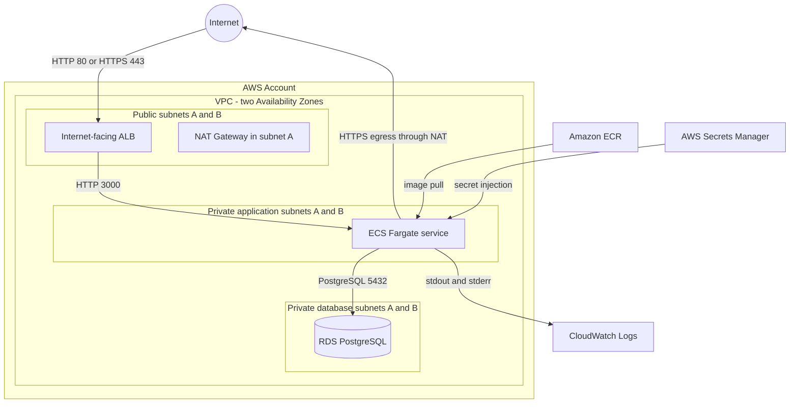

# NestForge AWS Architecture

## Goals

- Run the NestForge NestJS API on ECS Fargate behind an internet-facing ALB.
- Keep compute and PostgreSQL private while allowing controlled application egress.
- separate dev and prod state and settings without Terraform workspaces.
- Supply generated credentials through Secrets Manager and write application logs to CloudWatch.
- provide a clean foundation for commit-SHA deployments through GitHub OIDC later.

## Non-Goals

This phase does not implement GitHub Actions, GitHub OIDC, Route 53 records, ACM certificate creation, WAF, distributed tracing, third-party monitoring, a frontend, or load testing. Terraform does not apply itself and does not build application images.

## Architecture Overview

The ALB and ECS service use both AZs. The DB subnet group spans both AZs; dev runs a Single-AZ instance while prod enables Multi-AZ by default.

## Network Layout

| Tier | Dev CIDRs | Prod CIDRs | Route |
|---|---|---|---|
| VPC | `10.0.0.0/16` | `10.1.0.0/16` | VPC local routing |
| Public A/B | `10.0.1.0/24`, `10.0.2.0/24` | `10.1.1.0/24`, `10.1.2.0/24` | `0.0.0.0/0` to IGW |
| Private app A/B | `10.0.11.0/24`, `10.0.12.0/24` | `10.1.11.0/24`, `10.1.12.0/24` | `0.0.0.0/0` to NAT |
| Private DB A/B | `10.0.21.0/24`, `10.0.22.0/24` | `10.1.21.0/24`, `10.1.22.0/24` | Local only |

The first two available AZs are discovered dynamically unless `availability_zones` pins an explicit pair. Pinning is recommended after the first production deployment to avoid unexpected replacements if AWS ordering changes.

One NAT Gateway in public subnet A supplies outbound HTTPS for ECR, Secrets Manager, CloudWatch, and external APIs. This reduces portfolio cost but is an acknowledged cross-AZ dependency for tasks in AZ B. A later production hardening change can add one NAT and one app route table per AZ. No VPC endpoints are created yet.

## Traffic and Security Groups

| Source | Destination | Protocol/port | Purpose |
|---|---|---:|---|
| `0.0.0.0/0` | ALB SG | TCP 80 | Temporary HTTP or redirect; configurable |
| `0.0.0.0/0` | ALB SG | TCP 443 | Present only when an ACM ARN is supplied |
| ALB SG | ECS SG | TCP 3000 | NestJS traffic and health checks |
| ECS SG | RDS SG | TCP 5432 | PostgreSQL |
| ECS SG | `0.0.0.0/0` through NAT | TCP 443 | AWS endpoints and external HTTPS APIs |
| ECS SG | VPC CIDR | UDP/TCP 53 | VPC DNS resolver |

There is no PostgreSQL rule from the internet or the broad VPC CIDR. ALB egress is limited to ECS port 3000, and the RDS group has no explicit outbound rule. Security groups are stateful, so response traffic does not require reverse rules.

## Application Load Balancer

- Internet-facing across both public subnets.
- Target type `ip`, required by Fargate `awsvpc` networking.
- HTTP targets on port 3000.
- `GET /health` every 30 seconds, five-second timeout, HTTP `200` matcher, two healthy and three unhealthy thresholds.
- When no certificate is supplied, optional port 80 forwards for temporary testing.
- When a regional ACM certificate ARN is supplied, port 443 terminates TLS and port 80 redirects to HTTPS.
- Invalid HTTP headers are dropped; deletion protection is enabled by default in prod.

## ECS Fargate

The ECS service runs without public IPs in both private application subnets. The task uses `awsvpc`, Linux `X86_64`, a read-only root filesystem, an init process, CloudWatch `awslogs`, and container plus ALB health checks.

Environment values include the RDS hostname, port, database name, SSL controls, application port, and JWT expiry. `DB_USERNAME`, `DB_PASSWORD`, and `JWT_SECRET` are injected from JSON keys in one Secrets Manager secret. The execution uses Fargate platform `LATEST`, which must support JSON-key secret injection.

| Setting | Dev | Prod |
|---|---:|---:|
| CPU | 512 units | 512 units |
| Memory | 1024 MiB | 1024 MiB |
| Desired tasks | 1 | 2 |
| Minimum tasks | 1 | 2 |
| Maximum tasks | 3 | 6 |
| CPU target | 65% | 65% |
| Container Insights | Enabled | Enabled |

Rolling deployments retain 100% minimum healthy capacity and permit 200% maximum capacity. The deployment circuit breaker rolls back failed deployments. Autoscaling uses one CPU target-tracking policy with a 60-second scale-out and 300-second scale-in cooldown.

## ECR

Each environment creates an encrypted repository named `nestforge-<environment>-api`. Tags are immutable, scan-on-push is enabled, untagged images expire after seven days, and the newest 30 `sha-`, `release-`, or `manual-` images are retained. The initial manual tag is `manual-bootstrap`; later CI/CD should deploy unique Git commit SHA tags and never rely on `latest`.

## RDS PostgreSQL

- PostgreSQL major version 17 by default, with compatible minor upgrades enabled.
- Private DB subnet group across two AZs and `publicly_accessible = false`.
- Encrypted gp3 storage, 20 GiB initial allocation, and storage autoscaling.
- PostgreSQL logs exported to CloudWatch.
- Automated backup and maintenance windows are set in UTC.
- IAM database authentication is not enabled; generated credentials are stored in Secrets Manager.

| Setting | Dev | Prod |
|---|---|---|
| Instance | `db.t4g.micro` | `db.t4g.small` |
| Multi-AZ | No | Yes |
| Backup retention | 7 days | 30 days |
| Max storage | 100 GiB | 200 GiB |
| Deletion protection | No | Yes |
| Final snapshot | Skipped | Required |

The API currently uses the generated master credential. A future hardening step should bootstrap a separate least-privilege runtime database role and reserve the master credential for administration and migrations.

## Secrets Management

Terraform generates a 32-character RDS-compatible password and a 64-character JWT signing value. Both and the DB username are stored as JSON in `nestforge-<environment>/api`. No secret value is exposed as a root output or committed in tfvars.

Because Terraform creates the random values and secret version, the values exist in Terraform state. S3 state access must therefore be treated as secret access. Dev force-deletes the secret during teardown for repeatability; prod uses a 30-day recovery window.

## IAM

The execution role trusts only `ecs-tasks.amazonaws.com`, receives AWS's standard ECS execution policy for ECR/log delivery, and has an additional policy limited to `DescribeSecret` and `GetSecretValue` for the one application secret.

The task role is separate and currently has no permissions. Future AWS API calls must add narrow actions and resources to that role. No administrator policy is attached, and no GitHub role exists yet.

## CloudWatch

NestJS stdout/stderr uses the non-blocking `awslogs` driver and `/ecs/nestforge-<environment>-api`. Retention is 14 days in dev and 30 days in prod. Container Insights is enabled. Advanced alarms and dashboards remain a future monitoring phase.

## Database Migrations

Migrations must run as a one-off Fargate task using the deployed task definition, private app subnets, and ECS security group. The service task definition already contains the RDS endpoint and secrets; operators override only the command. The migration must succeed before a service rollout. Migrations are never run concurrently in every application task startup.

## State and Environment Isolation

Bootstrap creates one shared, hardened S3 bucket. Native S3 lockfiles protect concurrent operations. Dev and prod use separate roots and keys:

- `nestforge/dev/terraform.tfstate`
- `nestforge/prod/terraform.tfstate`

Provider default tags identify project, environment, manager, and application. Bootstrap local state remains separate from all application infrastructure.

## Cost and Availability Trade-offs

The main recurring costs are NAT Gateway hours/data, ALB hours/capacity, Fargate CPU/memory, RDS instance/storage/backups, CloudWatch ingestion/retention, Secrets Manager, and internet or cross-AZ transfer.

The design keeps the production shape while using one NAT, small Graviton RDS classes, modest Fargate sizing, finite log retention, and no paid VPC endpoints. Dev reduces tasks and database availability. Prod adds two tasks, Multi-AZ RDS, deletion protection, longer recovery, and longer logs. One NAT remains the principal production availability compromise.

## Deployment Assumptions

- The ECR tag exists before the ECS service is created or updated.
- The image listens on port 3000 and exposes `GET /health` with HTTP 200 only when the application and DB are healthy.
- The image contains the TypeORM migration CLI and compiled data source.
- The image trusts the current Amazon RDS CA bundle while certificate verification is enabled.
- The selected region supports the configured PostgreSQL major and instance class.
- A supplied ACM certificate is issued in the same region and already validated.

## Future Improvements

- GitHub Actions with AWS OIDC, repository/branch/environment-scoped trust, commit-SHA image pushes, migrations, and ECS deployments.
- ACM certificate creation and Route 53 alias records.
- One NAT Gateway and private app route table per AZ for stronger production egress resilience.
- Selected VPC endpoints if traffic/cost evidence justifies them.
- A least-privilege application DB user, secret rotation, CloudWatch alarms, dashboards, WAF, and tracing.
